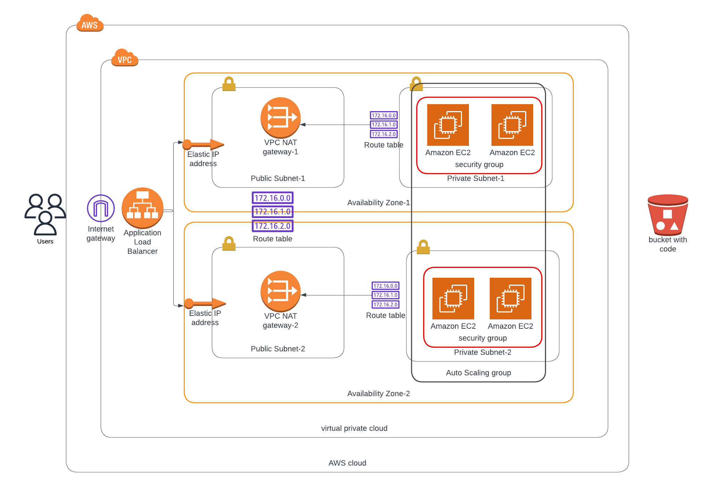

# DEPLOY A HIGH AVAILABILITY WEB APP USING CLOUDFORMATION

#### __Requirements__
- #### Cloudformation and an IDE (VS Code in this case) to create the following resources:
  - Virtual Private Cloud -  a secure, isolated private cloud hosted within a public cloud.
  - 2 Availability Zones for high availability
  - Public (can access the internet) and Private (cannot access the internet) subnets in each AZ.
  - An Internet Gateway - enables resources in your public subnets (such as EC2 instances) to connect to the internet 
  - 2 NAT gateway's for each AZ - enables instances in a private subnet to connect to services outside your VPC but external services cannot initiate a connection with those instances.
  - Elastic IP's -a reserved public IP address that you can assign to any EC2 instance.
  - EC2 Instances - used to create and run virtual machines in the cloud
  - Security Group for the instances - acting as a firewall to restrict incoming and outgoing traffic.
  - 1 Public Route Table - contains a set of rules, called routes, that are used to determine where network traffic from your subnet or gateway is directed.
  - 2 Private Route Tables - determine where network traffic from your subnet or gateway is directed, since each private subnets are routing to different NAT gateways.
  - An Application Load Balancer - evenly distribute incoming traffic.
  - An Auto Scaling Group - for automatic scaling of resources
  - An s3 bucket with an object (a .html file)- to store a static html file.

- #### Lucid chart to create an architecture diagram which will be used as a reference diagram for cloudformation template, seen below:

#### __File Description__
- __udagram-network-params.json__ -parameter file for network infrastructure, of which values will be passed to __udagram-network.yml__
- __udagram-network.yml__ -cloudformation template for network infrastructure
- __udagram-server-params.json__ -parameter file for server infrastructure, of which values will be passed to __udagram-server.yml__
- __udagram-server.yml__ -cloudformation template for server infrastructure
- __create.sh__ - contains the command to create a cloudformation stack
-  __update.sh__ - contains the command to update a cloudformation stack

- When a template is created using this command (on the terminal):
__./create.sh <name_of_cloudformation_stack> <cloudformation_template.yml> <cloudformation_parameter.json>__, the progress of how resources are created is shown on the __events__ tab for each stack created, as shown in the images below:
  
  
  
  
  
  
- The __output__ tab houses values that can be imported into other stacks

- Deployed app via the load balancer DNS

- Resources are deleted to avoid recurring charges, this is also well detailed on the events tab
  

   
#### Output URL : http://udagr-WebAp-140YVBX2AFWQ5-1582616062.us-east-1.elb.amazonaws.com - may not be accessible as resources have been cleaned up

